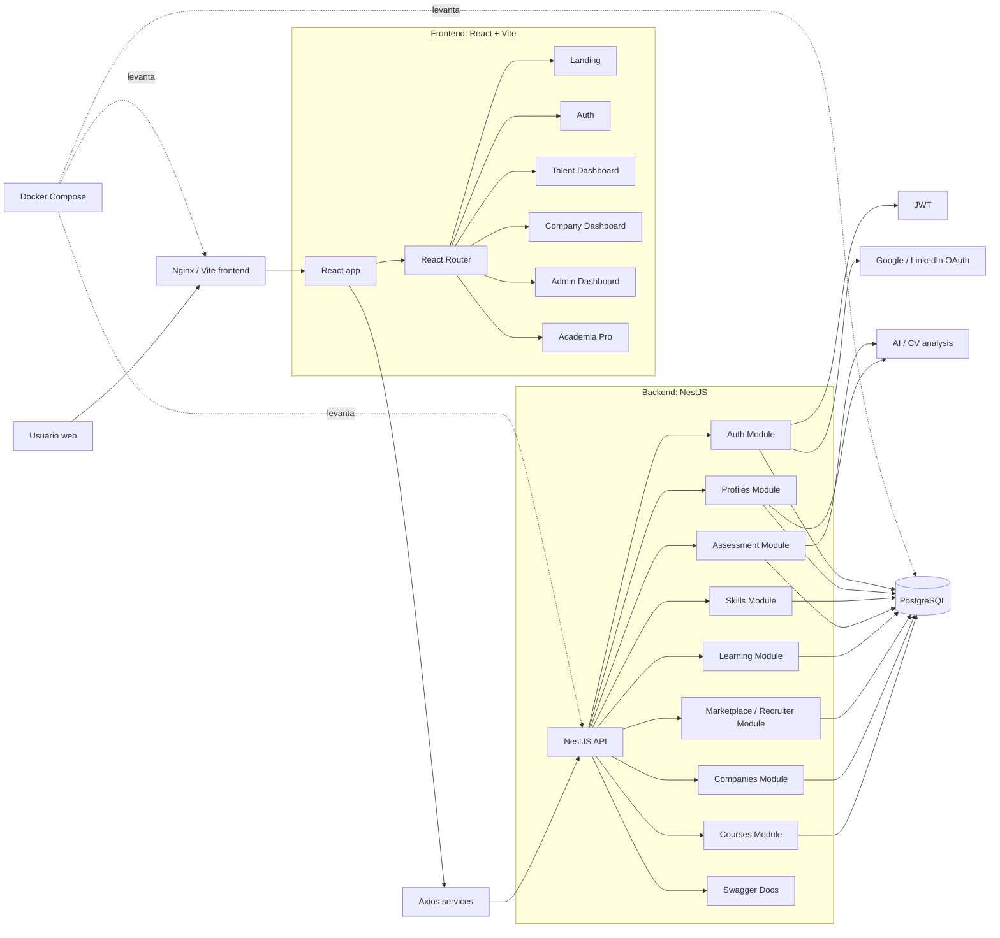

# App Talen

App Talen es una plataforma web para conectar talento, empresas y formacion profesional. El proyecto esta organizado como monorepo con una aplicacion frontend en React y un backend en NestJS con PostgreSQL.

## Contenido

- [Stack tecnico](#stack-tecnico)
- [Arquitectura](#arquitectura)
- [Estructura del repositorio](#estructura-del-repositorio)
- [Primeros pasos](#primeros-pasos)
- [Variables de entorno](#variables-de-entorno)
- [Levantar con Docker](#levantar-con-docker)
- [Levantar en desarrollo local](#levantar-en-desarrollo-local)
- [Rutas principales](#rutas-principales)
- [CI/CD](#cicd)
- [Runbook operativo](#runbook-operativo)
- [Comandos utiles](#comandos-utiles)
- [Documentacion adicional](#documentacion-adicional)

## Stack tecnico

Frontend:

- React 19
- TypeScript
- Vite
- Material UI
- React Router
- Axios

Backend:

- NestJS 11
- TypeScript
- TypeORM
- PostgreSQL
- JWT
- Swagger
- pnpm

Infraestructura local:

- Docker Compose
- PostgreSQL 16
- Nginx para servir el build del frontend

## Arquitectura



## Estructura del repositorio

```txt
.
├── Backend/
│   └── app-talen-backend/       # API NestJS
│       ├── src/modules/         # Modulos por dominio
│       ├── endpoints/           # Colecciones .http para pruebas manuales
│       ├── Dockerfile
│       └── README.md
├── Frontend/
│   └── appTalenFront/           # App React + Vite
│       ├── src/components/
│       ├── src/feactures/
│       ├── src/services/
│       ├── src/types/
│       ├── Dockerfile
│       └── README.md
├── docs/                        # Guias tecnicas y de validacion
├── docker-compose.yml           # Stack completo
└── .env.example                 # Variables de entorno de referencia
```

## Primeros pasos

Requisitos recomendados:

- Node.js 22
- npm, para el frontend
- pnpm 10, para el backend
- Docker y Docker Compose, si se usa el entorno containerizado

Crear el archivo de entorno:

```bash
cp .env.example .env
```

Revisar `.env` antes de levantar el proyecto. En desarrollo local, el backend expone la API sin prefijo global, por ejemplo `http://localhost:3000/auth/login`.

## Variables de entorno

Variables principales:

```env
PORT=3000
CORS_ORIGIN=*
DB_HOST=postgres
DB_PORT=5434
DB_USERNAME=postgres
DB_PASSWORD=postgres
DB_DATABASE=talent_db
TYPEORM_SYNC=true
JWT_SECRET=change-this-secret
JWT_EXPIRES_IN=7d
VITE_API_URL=http://localhost:3000
```

Tambien existen variables opcionales para OAuth:

```env
LINKEDIN_CLIENT_ID=
LINKEDIN_CLIENT_SECRET=
GOOGLE_CLIENT_ID=
GOOGLE_CLIENT_SECRET=
```

Nota: `TYPEORM_SYNC=true` es util en desarrollo porque sincroniza tablas automaticamente. Para produccion conviene usar migraciones y dejarlo en `false`.

## Levantar con Docker

Desde la raiz del repositorio:

```bash
docker compose up --build
```

El build del frontend toma `VITE_API_URL` desde `.env` y lo incorpora en los archivos estaticos generados por Vite.

Servicios esperados:

| Servicio | URL local |
| --- | --- |
| Frontend | `http://localhost:8080` |
| Backend API | `http://localhost:3000` |
| Swagger | `http://localhost:3000/docs` |
| PostgreSQL | `localhost:5434` |

Para detener los servicios:

```bash
docker compose down
```

Para eliminar tambien el volumen de base de datos:

```bash
docker compose down -v
```

## Levantar en desarrollo local

### Backend

```bash
cd Backend/app-talen-backend
pnpm install
pnpm run start:dev
```

La API queda disponible en `http://localhost:3000` y Swagger en `http://localhost:3000/docs`.

### Frontend

```bash
cd Frontend/appTalenFront
npm install
npm run dev
```

Vite informa la URL local, normalmente `http://localhost:5173`.

Configurar el frontend para consumir el backend:

```env
VITE_API_URL=http://localhost:3000
```

## Rutas principales

Frontend:

| Ruta | Descripcion |
| --- | --- |
| `/` | Landing page |
| `/login` | Inicio de sesion |
| `/register` | Registro |
| `/dashboard` | Dashboard segun rol: talento, empresa o admin |
| `/academia` | Academia Pro |

Backend:

| Modulo | Base path |
| --- | --- |
| Auth | `/auth` |
| Profiles | `/profiles` |
| Skills | `/skills` |
| Assessments | `/assessments` |
| Learning | `/learning-paths`, `/learning-modules` |
| Recruiter marketplace | `/recruiter` |
| Courses | `/courses` |

La documentacion interactiva de endpoints esta en Swagger: `http://localhost:3000/docs`.

## CI/CD

El proyecto utiliza GitHub Actions para validar cambios antes de integrarlos.

El workflow esta definido en `.github/workflows/ci.yml` y se ejecuta en `push` y `pull_request` hacia `main` y `develop`.

Checks esperados:

- Instalacion de dependencias frontend/backend
- Lint frontend/backend
- Build frontend/backend
- Tests backend
- Tests frontend si existe script configurado

Durante CI se levanta un servicio PostgreSQL 16 para validar los tests e2e del backend.

## Runbook operativo

### Problema: el frontend no conecta con backend

Verificar:

1. `VITE_API_URL` en Vercel o en el entorno donde se buildea el frontend. Debe apuntar a la URL publica del backend, sin `/api` si el backend mantiene las rutas actuales.
2. `CORS_ORIGIN` en Render o en el entorno del backend. Debe permitir el dominio del frontend.
3. Backend activo en Render o en la plataforma usada para desplegar la API.
4. Endpoint de salud. Si se implementa `/health`, usarlo como check principal; con el estado actual tambien se puede validar `GET /` o abrir `/docs`.
5. Errores en consola del navegador y en la pestana Network: revisar status HTTP, URL final, preflight CORS y respuesta del backend.
6. Token JWT en `localStorage` si el endpoint requiere autenticacion.

### Problema: errores de base de datos

Verificar:

1. Variables de conexion: `DATABASE_URL` si el deploy la usa, o `DB_HOST`, `DB_PORT`, `DB_USERNAME`, `DB_PASSWORD` y `DB_DATABASE` si se usan variables separadas.
2. Migraciones aplicadas o, en desarrollo, `TYPEORM_SYNC=true`.
3. Conexion desde backend hacia PostgreSQL: host, puerto, credenciales, SSL y permisos de red.
4. Logs de Render o de la plataforma donde corre el backend.
5. Estado de la base de datos: disponibilidad, limite de conexiones y espacio disponible.
6. Entidades TypeORM y cambios recientes en modelos que puedan requerir migracion.

### Problema: login o registro fallan

Verificar:

1. `JWT_SECRET` configurado en backend.
2. `JWT_EXPIRES_IN` con un valor valido, por ejemplo `7d`.
3. Payload enviado desde frontend a `/auth/login` o `/auth/register`.
4. Usuario existente, rol valido (`TALENT`, `COMPANY`, `ADMIN`) y password correcta.
5. Respuestas `401` o `400` en Network y logs del backend.

### Problema: OAuth Google o LinkedIn no funciona

Verificar:

1. `GOOGLE_CLIENT_ID` y `GOOGLE_CLIENT_SECRET`, o `LINKEDIN_CLIENT_ID` y `LINKEDIN_CLIENT_SECRET`.
2. Callback URL configurada en el proveedor OAuth.
3. URL publica del backend usada por el proveedor.
4. Logs del backend durante el callback.
5. CORS y cookies/sesion si el flujo depende del navegador.

### Problema: Docker Compose no levanta

Verificar:

1. `.env` creado desde `.env.example`.
2. Puerto `3000`, `8080` o `5434` libre en la maquina local.
3. Estado de PostgreSQL con `docker compose ps`.
4. Logs por servicio con `docker compose logs api`, `docker compose logs frontend` o `docker compose logs postgres`.
5. Rebuild limpio con `docker compose up --build` si cambiaron dependencias o variables de build del frontend.

## Comandos utiles

Frontend:

```bash
cd Frontend/appTalenFront
npm run dev
npm run lint
npm run build
```

Backend:

```bash
cd Backend/app-talen-backend
pnpm run start:dev
pnpm run lint
pnpm run test
pnpm run build
```

Docker:

```bash
docker compose up --build
docker compose down
docker compose down -v
```

## Documentacion adicional

- [Backend](Backend/app-talen-backend/README.md)
- [Frontend](Frontend/appTalenFront/README.md)
- [Indice de docs](docs/README.md)
- [Endpoints manuales REST Client](Backend/app-talen-backend/endpoints/README.md)
- [Configuracion de deploy](docs/DEPLOY_CONFIGURATION_VERCEL_RENDER_SUPABASE.md)
- [Flujo talento a reclutador](docs/DATA_FLOW_TALENT_TO_RECRUITER.md)
